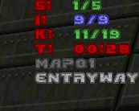

z-tracker
=======
For ZDoom ports.

Provides a configurable kill/secrets/items counter and a powerup cooldown timer.

Why? Not all huds support these counters but I still want the extra information

* Kill/secrets/items count
* Timer with par time
* Level names(s)
* Counts change color when full, timer changes colors as it approaches par time
* Countdown timers for active powerups

See [MENUDEF.txt](MENUDEF.txt) for a list of options to configure

Dev
---
1. Zip up these files
	* CVARINFO.txt
	* MAPINFO
	* MENUDEF.txt
	* tracker.zs
	* zscript.txt
2. Load zip in to gzdoom

#### Misc
* Compiled with ACC 1.56 win
* Tested with GZDoom 4.12.2 on windows

Changelog
---------
##### v2.0.0
* Convert from ACS to zscript

##### v1.2.0
* Actual GUI menu for options
* Powerup timer

##### v1.1.0
* XY position options
* Fix par time of 0 bug
* Default to exclude par time

##### v1.0.0
* Initial version
